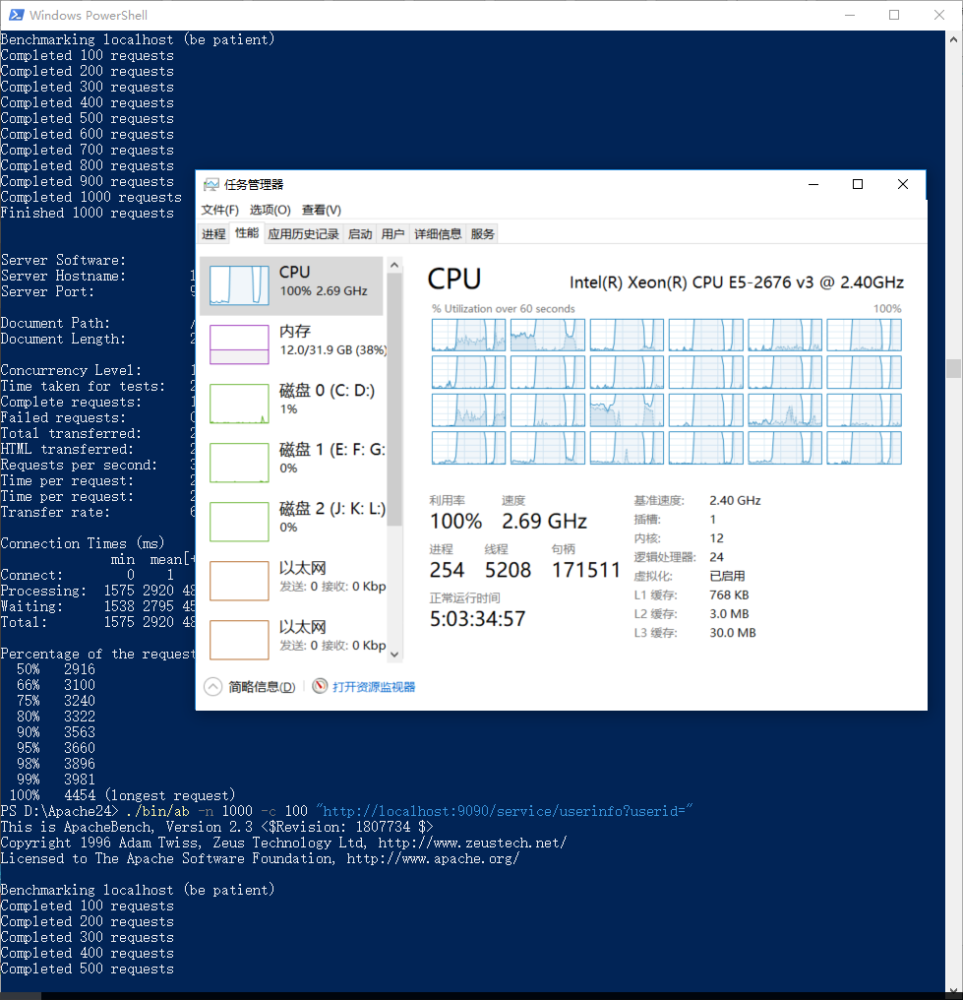

# cloudgo-datas

## 基本功能实现
Cloud Go "with" xorm & mysql   
实现的API(详细参数见下面测试说明)：  
1、新增一个用户 POST  
2、查找一个用户 GET  
3、查找所有用户 GET  
## 浏览器访问测试  
API功能：  
```
新增一个用户
```
Method
```
POST  
```
URL  
```
http://localhost:9090/service/userinfo
```
DATA:
```
username=aUserName&departname=aDepartmentName
```
  
  
  
API功能：  
```
查找id为 userid 的用户信息
```
Method
```
GET  
```
URL  
```
http://localhost:9090/service/userinfo?userid=aNumber
```
Params
```
userid 无符号整数，要查找的用户id
```
  
   
  
API功能：  
```
查找所有用户的信息
```
Method
```
GET  
```
URL  
```
http://localhost:9090/service/userinfo?userid=
```
  

## AB 测试
### POST : 新建 10000 个用户
post data: username=test&departname=test  
`./bin/ab -n 10000 -c 1000 -p test.txt  -T  'application/x-www-form-urlencoded'  "http://localhost:9090/service/userinfo"`  
  
可见平均消耗时间是273ms

### GET : 查询所有注册用户的信息 1000 次  
get URL : http://localhost:9090/service/userinfo?userid=  
`./bin/ab -n 1000 -c 100 "http://localhost:9090/service/userinfo?userid="`  
  
在测试过程中，CPU占用率高达100%，因为数据库表单里的元素多达10万多个，每次请求对数据库都是一次巨大的资源消耗。  
  
同时一次并发多达100个请求，xorm数据库访存出现瓶颈，处理时间明显变长，每个请求的平均延时激增到了2953ms。完成此次测试的1000个请求共用了长达29.539s的时间！  
难以相信这般成绩还是一台拥有12核24线程的志强e5处理器的服务器取得的。这效率真是让人大跌眼镜。  

  
大致的分析一下资源使用情况，发现mysql数据库操作并没有占用多少CPU资源，反而是go进行占用几乎所有CPU资源和高达3.42GB的内存！！  
假设一个用户信息占用内存为32字节，10万个用户也就约占3.2MB，每次并发1000个用户，共占用约3.2GB内存。与图中数据差不多，测试主机拥有4通道DDR4-2400内存，总容量32GB，绝不会因为内存读写和交换而产生性能瓶颈。  
考虑到该并发量并不大，而且orm操作的数据量较小时的效率远高于此次测试。所以，性能瓶颈是xorm产生的。也就是说，当xorm对于面对数量非常大的数据时，存在严重的性能瓶颈！！！  

### GET : 查询给定id的用户信息 10000 次   
get URL : http://localhost:9090/service/userinfo?userid=0  
`./bin/ab -n 10000 -c 1000 "http://localhost:9090/service/userinfo?userid=0"`  
  
每个请求的平均延时是223ms，同时并发1000个请求，由于数据库表单项多达10万，该成绩相比上一次作业中没有使用数据库只多了50ms左右，说明xorm一般情况访问数据库的效率还是非常高的。

### 进一步测试： 查询给定id的用户信息 10万 次 
同时并发1万个请求
get URL : http://localhost:9090/service/userinfo?userid=0  
`./bin/ab -n 100000 -c 10000 "http://localhost:9090/service/userinfo?userid=0"`  
  
每个请求的平均延时是3499ms，此次测试的负载压力(并发数量)是上次的10倍，但最终的延时却翻了15倍。  
  
分析CPU占用率，数据库mysqld进程并未占用多少资源，说明性能瓶颈不在数据库查询操作时间消耗上。  
反而是go进程占用了极大资源，一方面说明xorm访存性能随着负载增加而下降，另一方面，怀疑可能是命令行标准输出速度限制，导致后面的请求需要等待前面的标准输出结束才能继续执行，当请求数量很多时输出内容很多时，使得该等待时间明显变大。

## 总结  
我们使用orm是为了减轻工作量，把数据层的操作交给orm，我们的精力主要放在控制层的逻辑实现即可，因此也大大提高了编程效率。  
使用orm的优点和缺点：  
优点：  
（1）提高开发效率，降低开发成本。  
（2）使开发更加对象化。  
（3）可移植。  
（4）可以很方便地引入数据缓存之类的附加功能。  
缺点  
（1）自动化进行关系数据库的映射需要消耗系统性能。  
（2）在处理多表联查、where条件复杂之类的查询时，ORM的语法会变得复杂。  
（3）对于本次使用的xorm而言，数据量增大时，xorm自身效率会下降。面对非常大的数据以及高并发量的情况，xorm效率下降会非常明显，甚至因此出现性能瓶颈  


